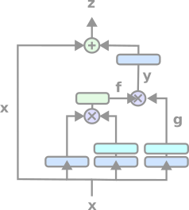

# Non-Local Blocks from Non-Local Neural Networks

Implementations of [Non-local Neural Networks (Wang et al. 2018)](https://arxiv.org/abs/1711.07971). *[Keras version](https://github.com/andrewrgarcia/non-local-blocks/blob/main/nonlocals/keras) is hard fork from the [Keras Non-Local Nets GitHub repo](https://github.com/titu1994/keras-non-local-nets) with significant corrections and improvemenets.



## Versions 

```python
from nonlocals.keras import NonLocalBlock
```
[Keras Layer](https://github.com/andrewrgarcia/non-local-blocks/blob/main/nonlocals/keras/non_local.py)

```python
from nonlocals.torch import NonLocalBlock
```
[PyTorch Module](https://github.com/andrewrgarcia/non-local-blocks/blob/main/nonlocals/torch/non_local.py)


